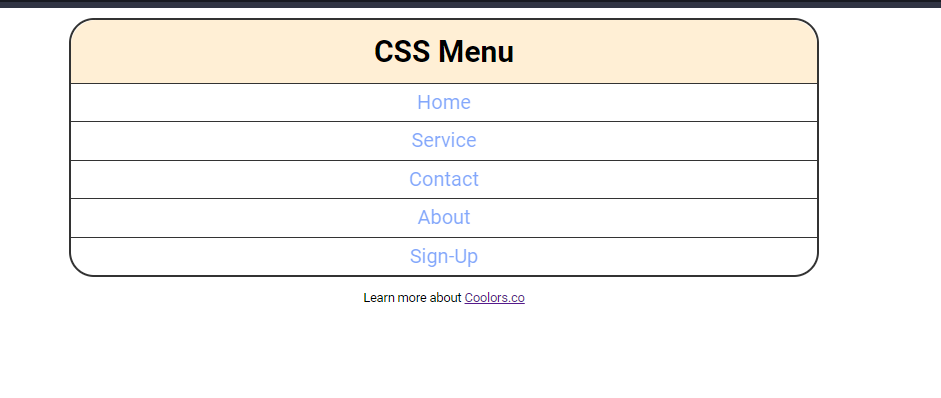

# Study_CSS


---

## project-: 1

a mini menu-bar made with the concepts of

1. selectors
2. Colors
3. Units and Sizes
4. Box-model
5. Typography
6. Styling links
7. list styles

UI-:


Code-:

```html
<!DOCTYPE html>
<html lang="en">
  <head>
    <meta charset="UTF-8" />
    <meta name="viewport" content="width=device-width, initial-scale=1.0" />
    <title>CSS Menu</title>
    <link rel="stylesheet" href="./index.css" />
  </head>

  <body>
    <nav>
      <h2>CSS Menu</h2>
      <ul>
        <li>
          <a href="one.html">Home</a>
        </li>
        <li>
          <a href="two.html">Service</a>
        </li>
        <li>
          <a href="two.html">Contact</a>
        </li>
        <li>
          <a href="two.html">About</a>
        </li>
        <li>
          <a href="two.html">Sign-Up</a>
        </li>
      </ul>
    </nav>

    <p>
      Learn more about
      <a href="https://coolors.co/gradient-palette/d4781a-aa3678?number=7">
        Coolors.co
      </a>
    </p>
  </body>
</html>
```

```css
@import url("https://fonts.googleapis.com/css2?family=Roboto:wght@400;700&display=swap");
@import url("https://fonts.googleapis.com/css2?family=Indie+Flower&display=swap");

* {
  margin: 0;
  padding: 0;
  box-sizing: border-box;
}

html {
  font-size: 10px;
}

body {
  font-family: "Roboto", sans-serif;
  margin: 0.8rem;
  text-align: center;
}

nav {
  border: 2px solid #333;
  border-radius: 2rem;
  margin: 0 auto 1rem;
  max-width: 60rem;
  font-size: 1.6rem;
  line-height: 3rem;
}

nav h2 {
  padding: 1rem;
  background: papayawhip;
  border-radius: 2rem 2rem 0 0;
}

ul {
  list-style-type: none;
}

li {
  border-top: 1px solid #333;
}

li a {
  display: block;
}

li a,
li a:visited {
  text-decoration: none;
  color: hsla(222, 94%, 50%);
  opacity: 0.5;
}

li a:hover,
li a:focus {
  opacity: 1;
  cursor: pointer;
  background: rgb(234, 242, 245);
}

li:last-child a {
  border-radius: 0 0 2rem 2rem;
}
```
